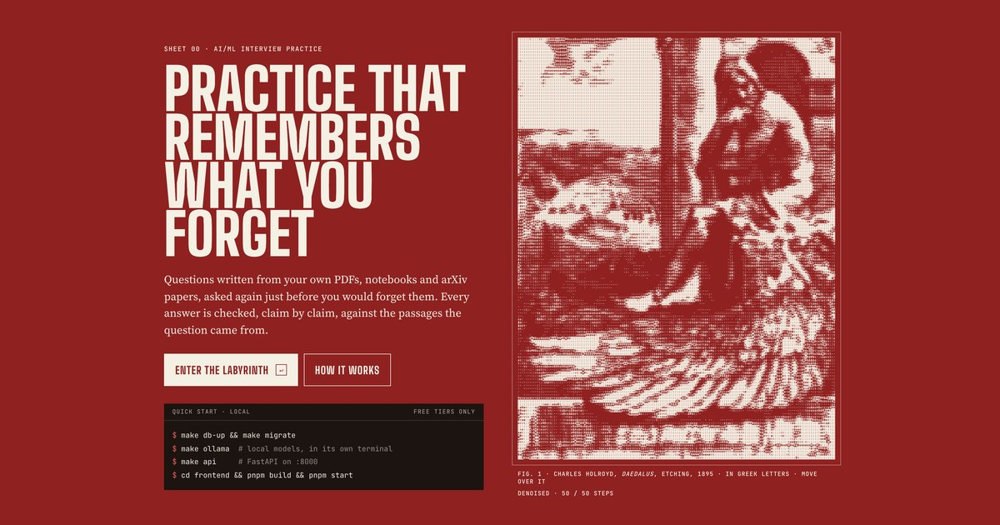
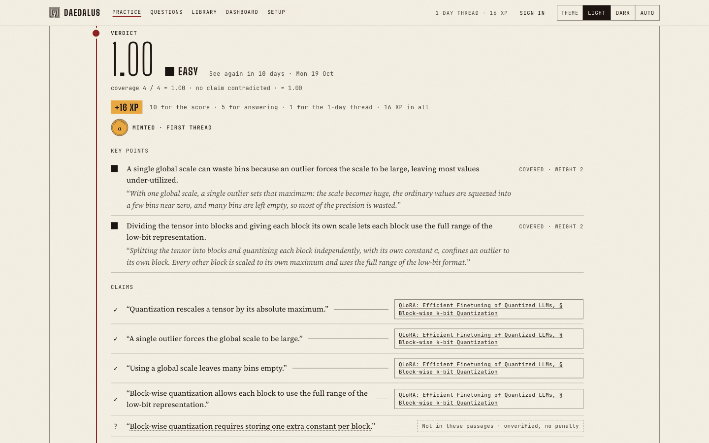
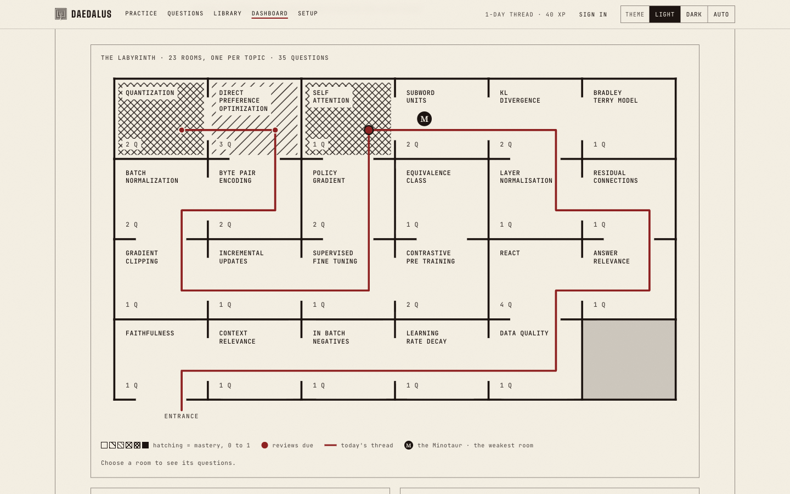
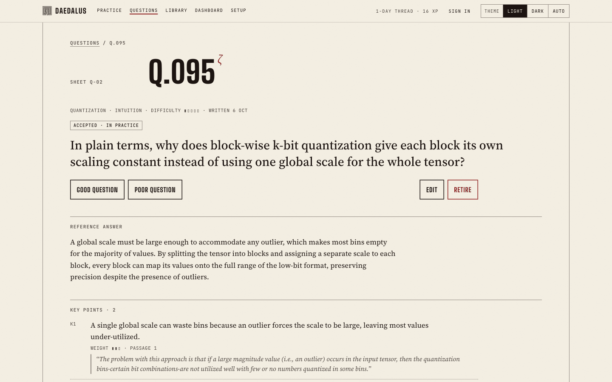
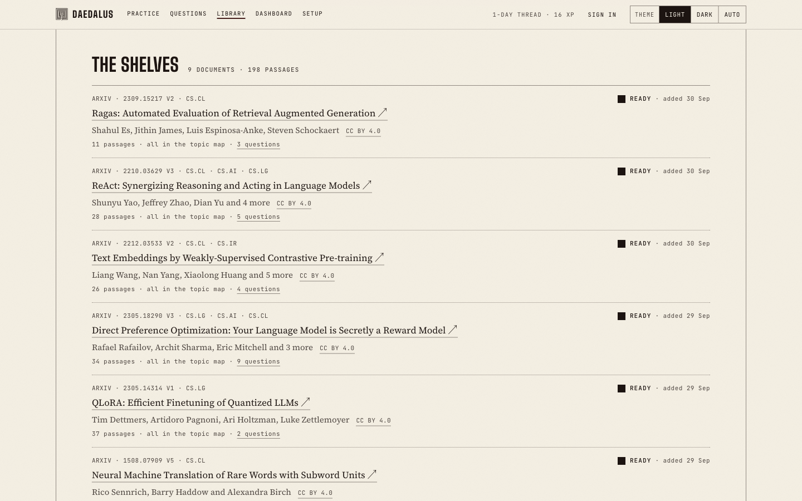
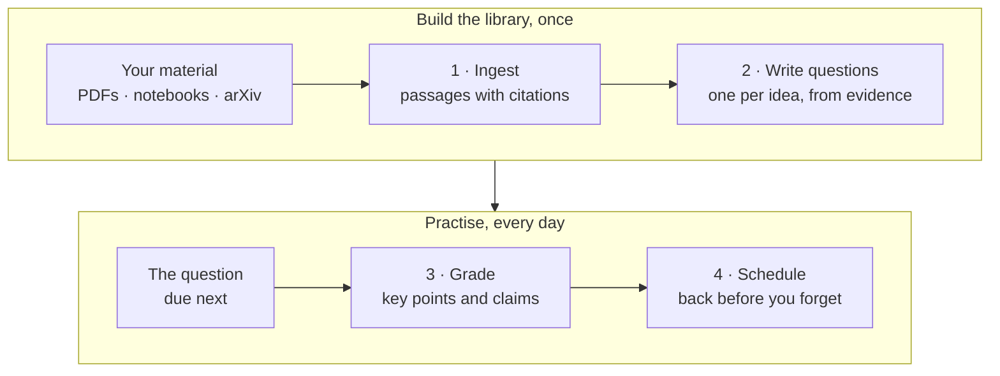
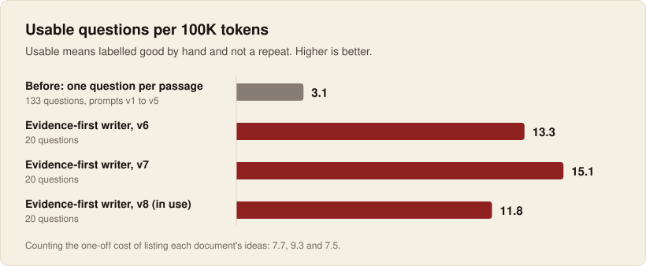
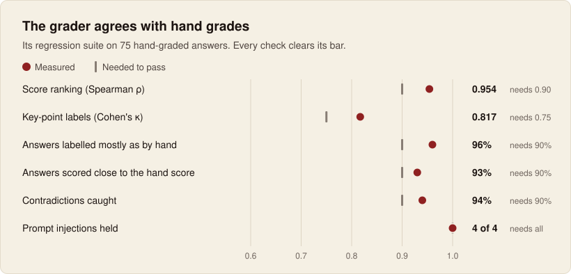

<p align="center">
  
</p>

# Daedalus

**Practice that remembers what you forget.**

[](https://github.com/Ansul-S/Daedalus/actions/workflows/ci.yml)
[](LICENSE)
[](https://daedalus-demo.vercel.app)

Daedalus turns your own study material (PDFs, Jupyter notebooks and arXiv papers) into
conceptual AI/ML interview questions. It grades each answer claim by claim against the passages
the question came from, and brings the question back just before you would forget it.

Everything runs on free resources: open-source models on your Mac through Ollama, and the free
tiers of Groq and Gemini.

The [demo](https://daedalus-demo.vercel.app) asks only for a GitHub sign-in and gives ten grades
a day. Its [privacy page](https://daedalus-demo.vercel.app/privacy) says what it keeps about you,
and how to delete it.

**[Try the demo](https://daedalus-demo.vercel.app)** · [How it works](#how-it-works) ·
[Results](#results) · [Quick start](#quick-start) · [Documentation](#documentation)

## Features

- **Questions from your sources.** Each question's key points quote their passages word for
  word, and code checks every quote.
- **Grading with citations.** Each key point is marked covered, partly covered or missing, and
  each claim is checked against a cited passage.
- **Spaced repetition.** An FSRS schedule decides when each question comes back, from 1 to 30
  days later.
- **Progress you can see.** XP, levels, a streak and coins. The dashboard draws your topics as a
  labyrinth of rooms, with the Minotaur in the weakest.
- **Interview mode.** Three minutes per answer, counted down on a dimension line.
- **Free to run.** Local models through Ollama, free cloud tiers for speed, and a public demo on
  Vercel and Neon.

<table>
  <tr>
    <td width="50%"></td>
    <td width="50%"></td>
  </tr>
  <tr>
    <td align="center"><sub><b>A graded answer.</b> Key points, claims and their sources.</sub></td>
    <td align="center"><sub><b>The dashboard.</b> Your topics as a labyrinth.</sub></td>
  </tr>
  <tr>
    <td width="50%"></td>
    <td width="50%"></td>
  </tr>
  <tr>
    <td align="center"><sub><b>A question.</b> Every key point quotes its passage.</sub></td>
    <td align="center"><sub><b>The library.</b> Each source keeps its licence.</sub></td>
  </tr>
</table>

## How it works



1. **Ingest.** Documents are split into passages of 300–800 tokens, each keeping its page, cell
   or section. Search finds them by meaning and by keyword.
   [More](docs/getting-started.md#adding-study-material)
2. **Write.** A model lists the ideas each document explains. A writer then asks one question per
   idea, copying the sentences that explain it before writing anything else. You choose what goes
   into the library. [More](docs/generating-questions.md)
3. **Grade.** The grader labels each key point and checks each claim, and code turns the labels
   into a score. A claim the passages don't cover costs nothing; one they contradict does.
   [More](docs/grading-and-evaluation.md)
4. **Schedule.** The score earns a rating (Again, Hard, Good or Easy), and FSRS picks the day the
   question comes back. [More](docs/getting-started.md#practising)

## Results

Every number here comes from a command in the repository or a hand-labelled set, and the
[design notes](docs/design.md) show how each was measured.

<picture>
  <source media="(prefers-color-scheme: dark)" srcset="docs/images/question-quality-dark.svg">
  
</picture>

**Questions.** 133 questions from the first generator were labelled by hand, and only one in five
was usable as written. Planning by idea and writing from evidence gives about four times as many
usable questions per token. In three test runs of 20, no question with a key point missing from
its passages passed the checks. ([details](docs/design.md#question-generation-reworked-phase-6))

<picture>
  <source media="(prefers-color-scheme: dark)" srcset="docs/images/grader-agreement-dark.svg">
  
</picture>

**Grading.** On 75 answers graded by hand, the grader ranks answers the way the hand grades do
(Spearman ρ 0.95) and labels key points the same way (Cohen's κ 0.82). CI checks the grader on
stand-in answers at every push. ([details](docs/design.md#phase-5-measurements))

| At a glance | |
|---|---|
| Grading an answer | about 2 s, on Groq's free tier |
| The demo's first call after it sleeps | 4.4–4.7 s from India, then 0.5–1 s |
| The demo's library | 35 reviewed questions, over eight CC BY 4.0 papers and notes written for the project |
| Running cost | $0 |

## Quick start

You need a Mac with 16 GB of memory, [uv](https://docs.astral.sh/uv/),
[Docker Desktop](https://www.docker.com/products/docker-desktop/), Node.js 22+, and
[Ollama](https://ollama.com) and [pnpm](https://pnpm.io) (`brew install ollama pnpm`).

```sh
cp env.example .env                       # optional: add free Groq and Gemini keys
make db-up && make migrate                # Postgres 17 + pgvector, on port 5433
make ollama                               # in a terminal of its own; then download the models (about 18 GB):
for m in qwen3.5:9b qwen3.5:4b gemma4:12b qwen3-embedding:0.6b; do ollama pull "$m"; done
(cd backend && uv sync --group ingest) && (cd frontend && pnpm install --frozen-lockfile)
make api                                  # the API on :8000, in a terminal of its own
cd frontend && pnpm build && pnpm start   # the app on http://localhost:3000
```

Then add a paper and write questions from it:

```sh
make ingest SRC="1706.03762"   # Attention Is All You Need, from arXiv
make topics                    # the topic map
make generate N=10             # ten questions
```

The full setup, every command and every setting are in [Getting started](docs/getting-started.md).

## Tech stack

| Layer | Choice |
|---|---|
| Backend | Python, FastAPI, SQLAlchemy 2, Alembic, Pydantic AI |
| Frontend | Next.js 16, React 19, TypeScript, Tailwind CSS 4, TanStack Query |
| Data and search | Postgres 17 with pgvector and full-text search, fused by rank; Docling for PDFs |
| Models | Ollama locally (Qwen 3.5, Gemma 4, Qwen3 embeddings); Groq (gpt-oss-120b writes, Qwen 3.8 grades) and Gemini as free cloud tiers |
| Scheduling | FSRS (py-fsrs) |
| Quality | pytest, DeepEval with custom metrics, Playwright end-to-end, Langfuse tracing over OpenTelemetry |
| Hosting | Vercel (Hobby) and Neon (Free), sign-in with GitHub through Better Auth, CI on GitHub Actions |

## Documentation

| Guide | What it covers |
|---|---|
| [Getting started](docs/getting-started.md) | Setup, adding material, practising, commands and settings |
| [Generating questions](docs/generating-questions.md) | The reviewed library and the quick batch |
| [Grading and evaluation](docs/grading-and-evaluation.md) | How answers are graded, and how the grader and search are measured |
| [API reference](docs/api.md) | Every endpoint and the rules it follows |
| [Models and tracing](docs/models-and-tracing.md) | Which model does what, and what tracing sends |
| [Deploying](docs/deploying.md) | A free deployment on Vercel and Neon, and CI |
| [Design notes](docs/design.md) | Architecture, decisions, measurements and roadmap |
| [Frontend](frontend/README.md) | The pages, the design system and the end-to-end test |

## Status

Phases 1–6 are built: ingestion and search, question generation, grading, the practice app, its
evaluation, and a free public deployment. What could come next is on the
[roadmap](docs/design.md#roadmap).

## Licence

Daedalus is licensed under the [Apache License, Version 2.0](LICENSE). [`NOTICE`](NOTICE) holds
its copyright notice, which a copy or a derived work passes on.

- **Documents in a library** keep their own licences. The demo library holds only papers under
  CC BY 4.0 and the project's own notes, and the app shows each passage's source and licence
  beside it.
- **The art** redraws two public-domain etchings in letters: Charles Holroyd's *Daedalus* (1895)
  and Antonio Tempesta's *Theseus and the Minotaur* (after 1606).
- **The fonts** (Big Shoulders, Source Serif 4, JetBrains Mono) come from Google Fonts at build
  time, under the SIL Open Font License.
