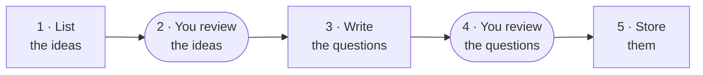

# Generating questions

Daedalus writes interview questions from the material in your library. Each question has a
reference answer and two to four key points. Every key point quotes the passage it comes from,
so an answer can be graded against the source.

There are two ways to write questions:

| | Reviewed library | Quick batch |
|---|---|---|
| **Best for** | A library you will share or practise from for a long time | Trying the app on new material |
| **Plans by** | Idea: each idea a document explains is asked once | Passage: a source at a time, a topic at a time |
| **Decides what goes in** | You, after reading each question | The automatic checks |
| **Runs from** | Three commands | The library page, or `make generate` |

The demo's 35 questions were written the reviewed way. Measured on 133 earlier questions, the
quick batch repeated itself (23% of its questions asked something already asked), and only one
question in five was usable as written. Planning by idea and writing from evidence gave about four
times as many usable questions for the same tokens: two and a half to three times, counting the
one-off cost of listing the ideas (see the [measurements](design.md#generation-rework-measurements)).

**Contents**

- [The reviewed library](#the-reviewed-library)
  - [Before you start](#before-you-start)
  - [Step 1: List the ideas](#step-1-list-the-ideas)
  - [Step 2: Review the ideas](#step-2-review-the-ideas)
  - [Step 3: Write the questions](#step-3-write-the-questions)
  - [Step 4: Review the questions](#step-4-review-the-questions)
  - [Step 5: Store them](#step-5-store-them)
- [The quick batch](#the-quick-batch)
  - [The topic map](#the-topic-map)
  - [Writing a batch](#writing-a-batch)
  - [What a question has to pass](#what-a-question-has-to-pass)

## The reviewed library



A model lists the ideas each document explains. You tidy the list. The writer asks one question
per idea, copying the sentences that explain it before it writes anything else. You keep the good
questions, fix small faults, and store the result.

### Before you start

- **Ingest your documents** ([Getting started](getting-started.md#adding-study-material)). Build
  the topic map too (`make topics`, [below](#the-topic-map)): stored questions are filed under its
  topics, which become the rooms of the dashboard.
- **Set `GROQ_API_KEY`** in `.env`. Listing the ideas and writing the questions both use Groq's
  `gpt-oss-120b` and nothing else, so that every question has the same writer. Groq's free tier
  allows 200,000 tokens a day.
- **Run Ollama** (`make ollama`). It embeds the ideas and the questions, and the local
  `qwen3.5:4b` reads every question.
- **Run the commands from `backend/`.** They work on the database `DATABASE_URL` names, with
  `ENVIRONMENT=local`. Their files go in `data/inventory/`, named after the database. The examples
  below use the default database, `daedalus`.

Every step saves as it goes. If a step stops, on Ctrl+C or because Groq's day is spent, run the
same command again: it carries on and never pays for the same answer twice. `--dry-run` shows
what a step would cost without calling a model.

### Step 1: List the ideas

```sh
uv run python -m scripts.inventory --document 4 --document 7 --dry-run   # what it reads, and the cost
uv run python -m scripts.inventory --document 4 --document 7
```

Give `--document` once for each document, by its id (`GET /documents` lists them). The command:

1. **Skips passages no idea can rest on:** passages that are mostly table, maths damaged in
   parsing, appendices and acknowledgements, and what the topic map's rules leave out (code only,
   setup, front matter).
2. **Reads each document in windows** of about 5,000 tokens, because Groq's free tier takes
   8,000 tokens a minute. For each idea it records:
   - a name and a one-line summary;
   - the passages that explain it;
   - what they explain: a mechanism, a reason, a trade-off, a failure, a comparison or a
     definition;
   - whether they give the reason or only state the fact;
   - whether the idea is general or belongs to this document alone;
   - how likely an interviewer is to ask about it, from 1 to 3;
   - one sentence copied from its passage, checked in code.
3. **Merges ideas listed twice:** within a document, a second call merges them. Across
   documents, ideas that come close by embedding (cosine 0.7 or more) go to the model, which
   decides whether they are one idea.

It saves the result to `data/inventory/daedalus.json` and lists every idea under a key,
`document.idea`: `4.2` is idea 2 of document 4. `--show` lists them again from the saved
answers without calling a model.

**Cost.** Reading the demo's last six documents took 19 requests and about 91K tokens.

### Step 2: Review the ideas

Read the list, then write your decisions to `data/inventory/daedalus.review.json`. Each decision
names an idea by its key and its name, so it can't land on another idea if the documents are
read again. Every later step applies the review, and `scripts.inventory --show` applies it again
without calling a model.

```json
{
  "merge": [[{"key": "8.1", "name": "Interleaved reasoning, action, and observation paradigm"},
             {"key": "8.7", "name": "Chain-of-thought vs. Act-only vs. ReAct comparison"}]],
  "scope": [{"key": "8.5", "name": "External Wikipedia API as minimal action space for knowledge retrieval",
             "scope": "document"}],
  "exclude": [{"key": "4.19", "name": "Robustness to sampling temperature",
               "reason": "its passage gives the result but not the reason"}],
  "keep_apart": [[{"key": "7.3", "name": "Answer relevance via generated question similarity"},
                  {"key": "7.4", "name": "Context relevance via extracted sentence proportion"}]],
  "check": []
}
```

| Field | What it does |
|---|---|
| `merge` | Ideas that are really one. The first keeps its key, name and summary, and takes the passages of the rest |
| `scope` | Corrects whether an idea is `general` or belongs to its `document` |
| `exclude` | Leaves an idea out of planning, with a reason. It stays in the list |
| `keep_apart` | Close ideas that stay separate |
| `check` | Ideas a later step should look at again, with a `note` |

**Choosing the ideas to write.** An interview question needs an idea that is general and whose
passages give the reason. The demo took every such idea at interview odds 3, then topped up with
odds 2.

### Step 3: Write the questions

```sh
uv run python -m scripts.write_questions --idea 4.2 4.3 7.1 --dry-run   # the styles, and the cost
uv run python -m scripts.write_questions --idea 4.2 4.3 7.1
uv run python -m scripts.write_questions --show                          # the checks again, no model call
```

Each idea is written evidence first:

1. **The writer gets one idea** and the full text of its passages, best first, up to 5,000
   tokens.
2. **It copies the sentences that explain the idea** before anything else. Then it writes the
   question, two to four key points that each rest on one of those sentences, and a reference
   answer made only of the key points.
3. **Code checks the answer** (below), and **the local model reads the question** beside its
   passages: can they answer it, and does answering mean explaining rather than recalling a fact?
4. **What the code finds wrong, and a recall reading, go back to the writer once,** with the
   problems named.

**The style follows the evidence.** The writer only asks what the passages can answer:

| Style | Asked only when the passages |
|---|---|
| Why / how | give the reason |
| Intuition | give the reason and explain a mechanism or a definition |
| Compare | draw a comparison |
| Trade-offs | name a trade-off in their own words |
| Failure modes | describe how it fails |

The styles are spread across the ideas you name, so that no style takes over.
`--style 4.14=compare` chooses one; it is refused when the evidence doesn't support it.

The questions are saved to `data/inventory/daedalus.questions.json` after each one, with every
check they passed and failed. `--out` keeps a run in another file. Keep it in `data/inventory/`,
where the next steps look for it.

**What the code checks:**

| Check | A question fails when |
|---|---|
| Evidence | a copied sentence isn't in the passages. A shortened sentence is accepted only when every piece is there, in order and within one sentence, leaving out no negation and no maths; a sentence with a formula has to be exact |
| Key points | there aren't two to four, or one doesn't rest on a sentence that holds up |
| Adds something | a key point only repeats the question, or grades a figure the question doesn't ask for |
| One question | it asks two things at once |
| Stands alone | it leans on the document: "the authors", "this paper", "Table 2", "according to the analysis" |
| Answerable | the local model, reading only the passages, can't answer it |
| Explains | the local model reads it as recalling a fact |

Every failure but an unanswerable question goes back to the writer once. A question that still
fails stays in the file with its report, and can't be stored.

**What is left to you.** Each question's nearest question, in the library and among the new
ones, is reported but doesn't turn a question down: the plan already asks each idea once.
Whether a key point says what its sentence says is checked at the review too. Three automatic
checks were measured on 422 hand-labelled key points, and none caught enough of the unsupported
ones without flagging too many good ones (see the
[design notes](design.md#rework-decisions)).

**Cost.** About 4.65K tokens a question, so roughly 40 questions fit in a free Groq day. The
demo's main run wrote 26 questions for 106K tokens, and a top-up of 13 took 48K.

### Step 4: Review the questions

Read each question beside its passages, and write the ones you keep to
`data/inventory/daedalus.library.json`, in the order they should go in:

```json
{
  "questions": [
    {
      "file": "daedalus.questions.json",
      "key": "1.1",
      "review": {"verdict": "good", "reason": "Its passage answers it.", "at": "2026-10-06T10:12:13Z"},
      "topic": "residual connections"
    },
    {
      "file": "daedalus.questions.json",
      "key": "1.3",
      "review": {"verdict": "fix", "reason": "k1 only restates the question.", "at": "2026-10-06T10:27:02Z"},
      "edit": {
        "reason": "k1 only restated what the question says warmup does.",
        "key_points": [
          {"text": "…", "weight": 3, "evidence_quote": "…", "chunk_id": 3},
          {"text": "…", "weight": 2, "evidence_quote": "…", "chunk_id": 3}
        ]
      }
    }
  ]
}
```

- **`verdict`** is `good` (kept as written) or `fix` (kept with an `edit`).
- **An `edit`** changes any of `text`, `reference_answer` and `key_points`. Key points are
  replaced as a whole, two to four of them, and each quote has to be in the passage it names.
- **`topic`** is optional. A question is filed under the topic its passages share most. Name
  another of its passages' topics when that one isn't what the question asks about.
- **Each idea goes in once.**

The demo's questions were judged against one rubric. A good question is one an interviewer could
ask as written, that its passages answer, and whose every key point is supported by its quote.

### Step 5: Store them

```sh
uv run python -m scripts.store_questions --dry-run   # what would go in, changing nothing
uv run python -m scripts.store_questions
```

- **Only a question that passed every check goes in.** It is stored as accepted, with the
  passages it was written from as its sources.
- **An edit is made the way the question bank makes a correction,** and recorded in the
  question's report.
- **A question already stored is left alone,** so the command can run again.
- **`--replace` also takes out the questions no review put in,** such as an earlier quick batch,
  in the same transaction. It refuses while any of them has been answered, scheduled, reviewed
  or rated.
- **`--library PATH`** reads another choice file.
- **Ollama has to be running:** each question is embedded for the duplicate check.

The questions then appear in the question bank and in practice.

## The quick batch

The quick batch is the original way to write questions, and what the browser's library page
does. It plans by passage, using the topic map, and keeps every question the checks accept.

```sh
make topics             # tag every chunk and cluster the tags into topics (once, after ingesting)
make generate N=20      # write 20 questions
```

### The topic map

`make topics` asks `qwen3.5:4b` what each chunk explains, for two to five concept tags, and
whether the chunk is worth asking a question about. Every distinct tag is then embedded and
clustered, so the same idea in a paper and in a notebook lands in one topic.

Options go in `ARGS`, for example `make topics ARGS="--rules-only"`:

| Option | Effect |
|---|---|
| `--document ID`, `--limit N` | Tag one document only, or at most N chunks |
| `--retag` | Tag chunks again that already have tags, e.g. after changing the prompt |
| `--tag-only`, `--cluster-only` | Stop before clustering, or cluster the tags there already are |
| `--rules-only` | Judge the stored tags by the context-only rules again, with no model calls |
| `--similarity X` | How close two tags have to be to share a topic (default `TOPIC_SIMILARITY`, 0.8) |

- It takes about 12 s per chunk, so roughly 25 minutes for a library of 124 chunks. Ollama
  must be running, and only one process may use the local models at a time: `make topics`
  doesn't start while a worker, `make ingest` or `make generate` is running. A running worker
  builds the map when asked through `POST /topics/build`, tagging only the chunks that have no
  tags yet.
- A chunk is context-only, and never asked about, when the model says it explains nothing or
  when a rule says so: chunks that are only code, and scaffolding such as roadmaps, learning
  objectives, setup and imports, acknowledgments and front matter. Context-only chunks keep
  their tags and can still be shown alongside a question.
- Topics keep their ids as long as their names survive, so questions stay filed where they are.

### Writing a batch

`make generate N=20` plans the batch, writes it down, and then works through it. Each question
goes to Groq's `gpt-oss-120b` (Gemini, then the local model, if Groq is unavailable) with its
source chunks in delimiters, and comes back as JSON: the question, a reference answer, two to
four key points each carrying an exact quote from a source, misconceptions, and a difficulty.

Options go in `ARGS`, for example `make generate ARGS="--job 17"`:

| Option | Effect |
|---|---|
| `--count N` | How many questions to write (also `N=` on `make generate`) |
| `--document ID` | Ask about one document only |
| `--job ID` | Carry on with a batch that stopped early |
| `--verbose` | Show library log messages |

- **Passages are picked a source at a time and a topic at a time,** so a batch spreads over
  the whole library instead of the one document that happens to hold the most material. The
  style rotates through intuition, why/how, compare, trade-offs, failure modes, connection and
  paper questions.
- **A chunk an accepted question already covers is left out,** so a second run breaks new ground.
- **Before it runs, the whole plan is written down** as one row per question. Ctrl+C loses at
  most the question in flight; `make generate ARGS="--job 16"` carries the rest on.
- **Each provider keeps its own pace** (Groq's free tier allows 30 requests and 8,000 tokens a
  minute, 200,000 a day). A provider that is briefly full is waited out rather than abandoned,
  and the batch stops cleanly when the day's budget is gone, leaving the rest queued.
- **Questions queued through the API** are written by the worker, the same one that ingests.

### What a question has to pass

Every question is stored either way, with the report behind the verdict, so a rejected one
says why.

| Check | A question is turned down when |
|---|---|
| quotes | a key point's quote is not in the chunk it names, after one round to repair it |
| answerable | the local model, reading only the sources, cannot answer it |
| trivia | that model reads it as recalling a fact rather than explaining something |
| duplicate | it is within `DUPLICATE_SIMILARITY` of a question already accepted |
